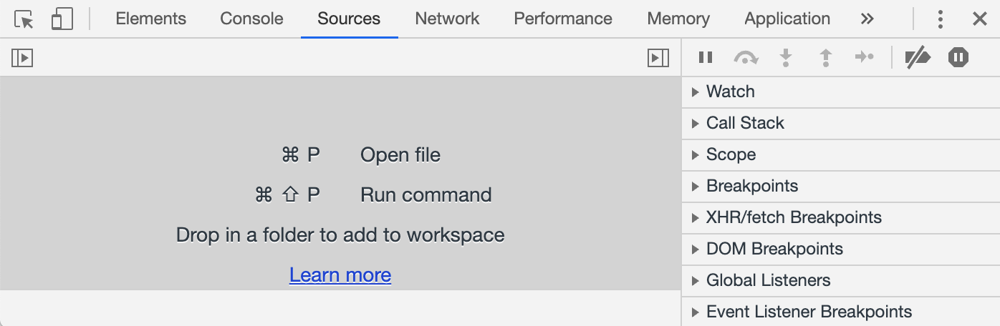
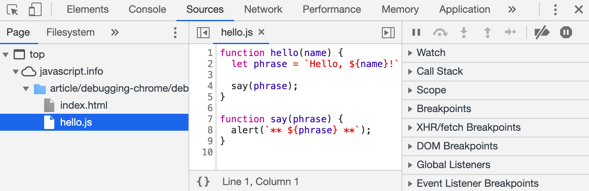
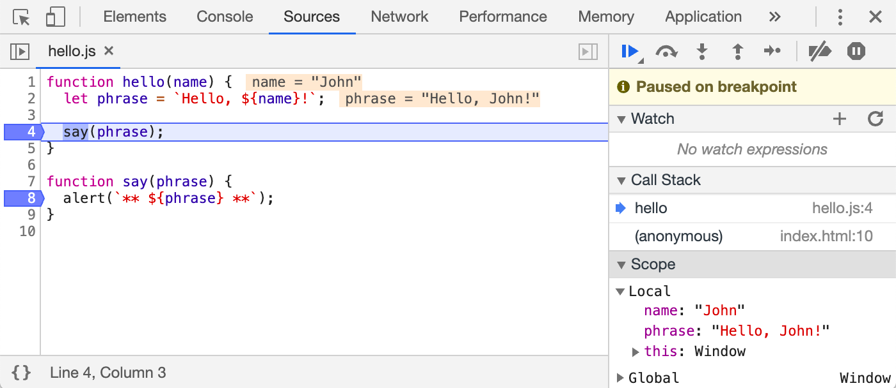

# Part1_정리

> 모던 JavaScript 튜토리얼 - https://ko.javascript.info

## 자바스크립트 기본

### [01] Hello, World! 

- `<script>` 태그를 이용하면 자바스크립트 프로그램을 HTML 문서 어느 곳에나 삽입할 수 있습니다.

- 아래와 같이 외부에서 작성된 파일을 사용할 수도 있습니다.

```javascript
<script src="/path/to/script.js"></script>
```

- 주의사항

  HTML 안에 직접 스크립트를 작성하는 방식은 대개 스크립트가 아주 **간단**할 때만 사용합니다. 스크립트가 길어지면 별개의 분리된 파일로 만들어 저장하는 것이 좋습니다.

  스크립트를 별도의 파일에 작성하면 **브라우저가 스크립트를 다운받아 캐시(cache)에 저장**하기 때문에, **성능상의 이점**이 있습니다.

  여러 페이지에서 동일한 스크립트를 사용하는 경우, 브라우저는 페이지가 바뀔 때마다 스크립트를 새로 다운받지 않고 캐시로부터 스크립트를 가져와 사용합니다. 스크립트 파일을 한 번만 다운받으면 되죠.

  이를 통해 트래픽이 절약되고 웹 페이지의 실제 속도가 빨라집니다.

- **`src`** 속성이 있으면 태그 내부의 코드는 무시됩니다. **`<script>`** 태그는 src 속성과 내부 코드를 동시에 가지지 못합니다. 다음과 같이 스크립트 두 개로 분리하면 정상적으로 실행됩니다.

  ```javascript
  <script src="file.js"></script>
  <script>
    alert(1);
  </script>
  ```


### [02] 코드 구조

- 문(statement) 구분은 **세미콜론**으로 한다.

```javascript
alert('Hello'); alert('World');
```

- 줄 바꿈이 있다면 세미콜론은 생략 가능하다. 암시적 세미콜론 해석 - **세미콜론 자동 삽입** (Automatic Semicolon Insertion)
- 하지만 삽입되지 않는 예외 상황도 존재하니 **세미콜론을 사용하는 것이 더 안전하다.**
- 한 줄 주석은 **`//`** 로,  여러 줄의 주석은 **`/* comment */`** 형식으로 작성된다.
- 중첩 주석은 지원하지 않는다.


### [03] 엄격 모드

- strict mode

```javascript
'use strict'; // 최상단에 적어줌

...
```

- 브라우저 콘솔에서는 기본적으로 적용되지 않는다. 다음과 같이 적용 및 실행 가능하다.

```
'use strict'; <Shift+Enter를 눌러 줄 바꿈 함>
//  ...테스트하려는 코드 입력
<Enter를 눌러 실행>
```

- 모던 자바스크립트는 '클래스’와 '모듈’이라 불리는 진일보한 구조를 제공합니다. 이 둘을 사용하면 **`use strict`** 가 자동으로 적용됩니다.


### [04] 변수와 상수

-  **`let`** 키워드를 사용해 변수를 생성한다.

```javascript
let message = 'Hello!';	
```

-  **`var`** 는 오래된 방식으로  **`let`** 키워드와 거의 동일하게 동작한다.
- 같은 변수를 여러 번 선언하면 에러가 발생한다.
- 변수 명명 규칙 (제약사항 두가지)
  - **변수명에는 오직 문자와 숫자, 그리고 기호 $와 _만 들어갈 수 있다.**
  - **첫 글자는 숫자가 될 수 없다.**
  - 여러 단어를 조합하여 변수명을 만들 땐 카멜 표기법이 흔히 사용된다. 단어를 차례대로 나열하면서 첫 단어를 제외한 각 단어의 첫 글자를 대문자로 작성하는 것이다.
- 변화하지 않는 변수인 상수를 선언할 땐 **`const`** 를 사용한다.

```javascript
const myBirthday = '09.18'
```

- 변수 명명시 참고하기 좋은 규칙
  - `userName` 이나 `shoppingCart`처럼 사람이 읽을 수 있는 이름을 사용하세요.
  - 무엇을 하고 있는지 명확히 알고 있지 않을 경우 외에는 줄임말이나 `a`, `b`, `c`와 같은 짧은 이름은 피하세요.
  - 최대한 서술적이고 간결하게 명명해 주세요. `data`와 `value`는 나쁜 이름의 예시입니다. 이런 이름은 아무것도 설명해주지 않습니다. 코드 문맥상 변수가 가리키는 데이터나 값이 아주 명확할 때에만 이런 이름을 사용합시다.
  - 자신만의 규칙이나 소속된 팀의 규칙을 따르세요. 만약 사이트 방문객을 'user’라고 부르기로 했다면, 이와 관련된 변수를 `currentVisitor`나 `newManInTown`이 아닌 `currentUser`나 `newUser`라는 이름으로 지어야 합니다.


### [05] 자료형

- 자바스크립트에는 **여덟 가지 기본 자료형**이 있습니다. 

- 자바스크립트의 변수는 자료형에 관계없이 모든 데이터일 수 있습니다. 따라서 변수는 어떤 순간에 문자열일 수 있고 다른 순간엔 숫자가 될 수도 있습니다. -> **동적 타입 (dynamic typed) 언어**

  ```javascript
  // no error
  let message = "hello";
  message = 123456;
  ```

- **숫자형**엔 일반적인 숫자 외에 `Infinity`, `-Infinity`, `NaN`같은 '특수 숫자 값(special numeric value)'이 포함됩니다.

  - `Infinity`는 어떤 숫자보다 큰 특수 값, 무한대(∞)를 나타냅니다.

  ```javascript
  alert( 1 / 0 ); // 무한대
  alert( Infinity ); // 무한대
  ```

  - `NaN`은 계산 중에 에러가 발생했다는 것을 나타내주는 값입니다. 

  ```javascript
  alert( "숫자가 아님" / 2 ); // NaN, 문자열을 숫자로 나누면 오류가 발생합니다.
  ```

  - 말이 안 되는 수학 연산을 하더라도 스크립트는 치명적인 에러를 내뿜으며 죽지 않습니다. `NaN`을 반환하며 연산이 종료될 뿐입니다.

- 내부 표현 방식 때문에 자바스크립트에선 `(253-1)`(`9007199254740991`) 보다 큰 값 혹은 `-(253-1)` 보다 작은 정수는 '숫자형’을 사용해 나타낼 수 없습니다. **`BigInt`** 형은 표준으로 채택된 지 얼마 안 된 자료형으로, 길이에 상관없이 정수를 나타낼 수 있습니다.

```javascript
// 끝에 'n'이 붙으면 BigInt형 자료입니다.
const bigInt = 1234567890123456789012345678901234567890n;
```

- 자바스크립트에선 문자열(string)을 따옴표로 묶습니다.

  ```javascript
  let str = "Hello";
  let str2 = 'Single quotes are ok too';
  let phrase = `can embed another ${str}`;
  ```

  - 따옴표는 세 종류가 있습니다.
    1. 큰따옴표: `"Hello"`
    2. 작은따옴표: `'Hello'`
    3. 역 따옴표(백틱, backtick):  ``Hello``
    
    - **역 따옴표**로 변수나 표현식을 감싼 후 **`${…}`** 안에 넣어주면, 아래와 같이 원하는 변수나 표현식을 문자열 중간에 손쉽게 넣을 수 있습니다.
    
    ```javascript
    let name = "John";
    
    // 변수를 문자열 중간에 삽입
    alert( `Hello, ${name}!` ); // Hello, John!
    
    // 표현식을 문자열 중간에 삽입
    alert( `the result is ${1 + 2}` ); // the result is 3
    ```
  
- 불린형(논리 타입)은 `true`와 `false` 두 가지 값밖에 없는 자료형입니다.

-  **`null`** 값은 지금까지 소개한 자료형 중 어느 자료형에도 속하지 않는 값입니다.

  - 자바스크립트에선 `null`을 ‘존재하지 않는(nothing)’ 값, ‘비어 있는(empty)’ 값, ‘알 수 없는(unknown)’ 값을 나타내는 데 사용합니다.

```javascript
let age = null;
```

-  **`undefined`** 는 '값이 할당되지 않은 상태’를 나타낼 때 사용합니다. 변수는 선언했지만, 값을 할당하지 않았다면 해당 변수에 `undefined`가 자동으로 할당됩니다. 명시적 할당도 가능하다.

```javascript
let age;

alert(age); // 'undefined'가 출력됩니다.
```

- **`객체(object)`** 형은 특수한 자료형입니다. 객체형을 제외한 다른 자료형은 문자열이든 숫자든 한 가지만 표현할 수 있기 때문에 원시(primitive) 자료형이라 부릅니다. 반면 객체는 데이터 컬렉션이나 **복잡한 개체**(entity)를 표현할 수 있습니다.

- **`심볼(symbol)`** 형은 객체의 고유한 식별자(unique identifier)를 만들 때 사용됩니다. 

- **`typeof`** 연산자는 인수의 자료형을 반환합니다.

  - `typeof` 연산자는 두 가지 형태의 문법을 지원합니다.
    1. 연산자: `typeof x`
    2. 함수: `typeof(x)`

  ```javascript
  typeof undefined // "undefined"
  typeof 0 // "number"
  typeof 10n // "bigint"
  typeof true // "boolean"
  typeof "foo" // "string"
  typeof Symbol("id") // "symbol"
  typeof Math // "object"
  typeof null // "object" null은 객체가 아님, 언어 자체의 오류
  typeof alert // "function"
  ```

  


### [06] alert, prompt, confirm을 이용한 상호작용

- **`alert`** 함수가 실행되면 사용자가 ‘확인(OK)’ 버튼을 누를 때까지 메시지를 보여주는 창이 계속 떠있게 됩니다.

  - 메시지가 있는 작은 창은 ***모달 창(modal window)*** 이라고 부릅니다. '모달’이란 단어엔 페이지의 나머지  부분과 상호 작용이 불가능하다는 의미가 내포되어 있습니다. 따라서 사용자는 모달 창 바깥에 있는 버튼을 누른다든가 하는 행동을 할 수 없습니다. 확인 버튼을 누르기 전까지 말이죠.

  ```javascript
  alert("Hello");
  ```

- 브라우저에서 제공하는 **`prompt`** 함수는 두 개의 인수를 받습니다. 함수가 실행되면 텍스트 메시지와 입력 필드(input field), 확인(OK) 및 취소(Cancel) 버튼이 있는 모달 창을 띄워줍니다.

```javascript
result = prompt(title, [default]);
```

	1. `title` :사용자에게 보여줄 문자열
 	2. `default` :입력 필드의 초깃값(필수가 아닌 선택값)

- `prompt` 함수는 사용자가 입력 필드에 기재한 **문자열**을 반환합니다. 사용자가 입력을 취소한 경우는 `null`이 반환됩니다.

```javascript
let age = prompt('나이를 입력해주세요.', 100);

alert(`당신의 나이는 ${age}살 입니다.`); // 당신의 나이는 100살입니다.
```

- **`confirm`** 함수는 매개변수로 받은 `question(질문)`과 확인 및 취소 버튼이 있는 모달 창을 보여줍니다. 사용자가 확인버튼를 누르면 **`true`**, 그 외의 경우는 **`false`** 를 반환합니다.

```javascript
let isBoss = confirm("당신이 주인인가요?");

alert( isBoss ); // 확인 버튼을 눌렀다면 true가 출력됩니다.
```

- 지금까지 살펴본 세 함수엔 두 가지 제약사항이 있습니다.
  1. **모달 창**의 위치는 브라우저가 결정하는데, 대개 브라우저 중앙에 위치합니다.
  2. **모달 창**의 모양은 브라우저마다 다릅니다. 개발자는 창의 모양을 수정할 수 없습니다.


### [07] 형 변환

- `alert`가 전달받은 값의 자료형과 관계없이 이를 문자열로 **자동 변환**하여 보여주는 것이나, 수학 관련 연산자가 전달받은 값을 숫자로 변환하는 경우가 형 변환의 대표적인 예시입니다.
- 전달받은 값을 의도를 갖고 원하는 타입으로 변환(**명시적 변환**)해 주는 경우도 형 변환이라고 할 수 있습니다.

```javascript
let value = true;
alert(typeof value); // boolean

value = String(value); // 변수 value엔 문자열 "true"가 저장됩니다.
alert(typeof value); // string
```

- 숫자형으로의 변환은 수학과 관련된 함수와 표현식에서 자동으로 일어납니다.

```javascript
alert( "6" / "2" ); // 3, 문자열이 숫자형으로 자동변환된 후 연산이 수행됩니다.
```

- **`Number(value)`** 함수를 사용하면 주어진 값(`value`)을 숫자형으로 명시해서 변환할 수 있습니다.

```javascript
let str = "123";
alert(typeof str); // string

let num = Number(str); // 문자열 "123"이 숫자 123으로 변환됩니다.

alert(typeof num); // number
```

- 숫자형으로 변환 시 적용되는 규칙

| 전달받은 값      | 형 변환 후                                                   |
| ---------------- | ------------------------------------------------------------ |
| **`undefined`**  | **`NaN`**                                                    |
| `null`           | `0`                                                          |
| `true and false` | `1` 과 `0`                                                   |
| `string`         | 문자열의 처음과 끝 공백이 제거됩니다. 공백 제거 후 남아있는 문자열이 없다면 `0`, 그렇지 않다면 문자열에서 숫자를 읽습니다. 변환에 실패하면 `NaN`이 됩니다. |

- 숫자 `0`, 빈 문자열, `null`, `undefined`, `NaN`과 같이 직관적으로도 “비어있다고” 느껴지는 값들은 `false`가 됩니다.
- 그 외의 값은 `true`로 변환됩니다.


### [08] 기본 연산자와 수학

-  이항 연산자 `+`를 사용할 때는 피연산자 중 하나가 문자열이면 다른 하나도 문자열로 변환된다는 점에 주의해야 합니다.

```javascript
alert( '1' + 2 ); // "12"
alert( 2 + '1' ); // "21"
alert(2 + 2 + '1' ); // '221'이 아니라 '41'이 출력됩니다. 연산은 왼쪽에서 오른쪽으로 순차적으로 진행.
```

- 다른 산술 연산자가 오직 숫자형의 피연산자만 다루고, 피연산자가 숫자형이 아닌 경우에 그 형을 숫자형으로 바꾸는 것과는 대조적입니다.
- 덧셈 연산자 `+`는 피연산자가 숫자가 아닌 경우엔 숫자형으로의 변환이 일어납니디.

```javascript
// 숫자에는 아무런 영향을 미치지 않습니다.
let x = 1;
alert( +x ); // 1

let y = -2;
alert( +y ); // -2

// 숫자형이 아닌 피연산자는 숫자형으로 변화합니다.
alert( +true ); // 1
alert( +"" );   // 0
```

- 쉼표 연산자 `,`는 여러 표현식을 코드 한 줄에서 평가할 수 있게 해줍니다. 이때 표현식 각각이 모두 평가되지만, 마지막 표현식의 평가 결과만 반환되는 점에 유의해야 합니다.

```javascript
let a = (1 + 2, 3 + 4);
alert( a ); // 7 (3 + 4의 결과)

a = 1 + 2, 3 + 4
alert( a ); // 3 (1 + 2의 결과)
```


### [09] 비교 연산자

- 자바스크립트는 **'사전’순으로 문자열을 비교** 합니다. '사전편집(lexicographical)'순 이라고 불리기도 하는 이 기준을 적용하면 사전 뒤쪽의 문자열은 사전 앞쪽의 문자열보다 크다고 판단됩니다.
  - 정확히는 사전순이 아니라 **유니코드** 순입니다.
- 비교하려는 값의 자료형이 다르면 자바스크립트는 이 값들을 숫자형으로 바꿉니다.
  - 불린값의 경우 true는 1, false는 0으로 변환된 후 비교가 이뤄집니다.

```javascript
alert( '2' > 1 ); // true, 문자열 '2'가 숫자 2로 변환된 후 비교가 진행됩니다.
alert( '01' == 1 ); // true, 문자열 '01'이 숫자 1로 변환된 후 비교가 진행됩니다.

alert( 0 == false ); // true
alert( '' == false ); // true
```

- 일치 연산자(strict equality operator) **`===`** 를 사용하면 형 변환 없이 값을 비교할 수 있습니다.
  - 자료형의 동등 여부까지 검사
  - “불일치” 연산자 `!==`는 부등 연산자 `!=`의 엄격한 형태입니다.

```javascript
alert( 0 === false ); // false, 피연산자의 형이 다르기 때문입니다.
```

- null이나 undefined와 비교하기

```javascript
alert( null === undefined ); // false - 두 값의 자료형이 다르기 때문에 일치 비교 시 거짓이 반환
alert( null == undefined ); // true - '각별한 커플’처럼 취급
```

- `null`과 0을 비교해 봅시다.
  - `null`은 `0`, `undefined`는 `NaN`으로 변합니다.

```javascript
alert( null > 0 );  // (1) false - 숫자형 0으로 변환
alert( null == 0 ); // (2) false - 동등연산자는 형변환 일어나지 않음. null 과 0 은 같지 않으므로 false
alert( null >= 0 ); // (3) true - 숫자형 0으로 변환
```

- `undefined`를 다른 값과 비교해서는 안 됩니다.
  - `undefined`가 `NaN`으로 변환되는데(숫자형으로의 변환), `NaN`이 피연산자인 경우 비교 연산자는 항상 `false`를 반환합니다.

```javascript
alert( undefined > 0 ); // false (1) - 숫자형 NaN 으로 변환
alert( undefined < 0 ); // false (2) - 숫자형 NaN 으로 변환
alert( undefined == 0 ); // false (3) - 동등연산자는 형변환 일어나지 않음. undefined 와 0 은 같지 않으므로 false
```


### [10] if와 '?'를 사용한 조건 처리

- if 문과 삼항연산


### [11] 논리 연산자

- 자바스크립트에서만 제공하는 **논리연산자 OR** 의 추가기능에 대해 알아보겠습니다.

  - OR 연산자와 피연산자가 여러 개인 경우, OR **`||`** 연산자는 다음 순서에 따라 연산을 수행합니다.

    - 가장 왼쪽 피연산자부터 시작해 오른쪽으로 나아가며 피연산자를 평가합니다.
    - 각 피연산자를 불린형으로 변환합니다. 변환 후 그 값이 **`true`** 이면 연산을 멈추고 해당 피연산자의 **변환 전** 원래 값을 반환합니다.
    - 피연산자 모두를 평가한 경우(모든 피연산자가 `false`로 평가되는 경우)엔 마지막 피연산자를 반환합니다.

    ```javascript
    let firstName = "";
    let lastName = "";
    let nickName = "바이올렛";
    
    alert( firstName || lastName || nickName || "익명"); // 바이올렛. 
    // 모든 변수가 falsy이면 "익명"이 출력.
    ```

  - **단락 평가** 의 동작 방식은 두 번째 피연산자가 변수 할당과 같은 부수적인 효과(side effect)를 가지는 표현식 일 때 명확히 볼 수 있습니다.

  ```javascript
  true || alert("not printed"); // alert 미실행
  false || alert("printed");
  ```

- AND 연산자와 피연산자가 여러 개인 경우를 살펴봅시다.

  - AND 연산자 **`&&`** 는 아래와 같은 순서로 동작합니다.
    - 가장 왼쪽 피연산자부터 시작해 오른쪽으로 나아가며 피연산자를 평가합니다.
    - 각 피연산자는 불린형으로 변환됩니다. 변환 후 값이 **`false`** 이면 평가를 멈추고 해당 피연산자의 **변환 전** 원래 값을 반환합니다.
    - 피연산자 모두가 평가되는 경우(모든 피연산자가 `true`로 평가되는 경우)엔 **마지막 피연산자** 가 반환됩니다.

  ```javascript
  // 첫 번째 피연산자가 truthy이면,
  // AND는 두 번째 피연산자를 반환합니다.
  alert( 1 && 0 ); // 0
  alert( 1 && 5 ); // 5
  
  // 첫 번째 피연산자가 falsy이면,
  // AND는 첫 번째 피연산자를 반환하고, 두 번째 피연산자는 무시합니다.
  alert( null && 5 ); // null
  alert( 0 && "아무거나 와도 상관없습니다." ); // 0
  ```

- 차이점은 **AND 연산자가 첫 번째 *falsy*** 를 반환하는 반면, **OR은 첫 번째 *truthy*** 를 반환한다는 것입니다.
- `&&`의 우선순위가 `||`보다 높습니다.
- NOT 연산자는 인수를 하나만 받고, 다음 순서대로 연산을 수행합니다.
  1. 피연산자를 불린형(`true / false`)으로 변환합니다.
  2. 1에서 변환된 값의 역을 반환합니다.
- NOT을 두 개 연달아 사용(`!!`)하면 값을 불린형으로 변환할 수 있습니다.
  
  - 첫 번째 NOT 연산자는 피연산자로 받은 값을 불린형으로 변환한 후 이 값의 역을 반환하고, 두 번째 NOT 연산자는 첫 번째 NOT 연산자가 반환한 값의 역을 반환합니다. 

```javascript
alert( !!"non-empty string" ); // true
alert( !!null ); // false
```

- `alert`를 호출하면 `undefined`가 반환됩니다. `alert`는 단순히 얼럿 창에 메시지만 띄워주고, 의미 있는 값을 반환해 주지 않습니다.


### [12] null 병합 연산자 '??'

- **null 병합 연산자**(nullish coalescing operator) **`??`** 를 사용하면 짧은 문법으로 여러 피연산자 중 그 값이 ‘확정되어있는’ 변수를 찾을 수 있습니다.
- **`a ?? b`** 의 평가 결과는 다음과 같습니다.
  - `a`가 `null`도 아니고 `undefined`도 아니면 `a`
  - 그 외의 경우는 `b`

```javascript
x = (a !== null && a !== undefined) ? a : b;
x = a ?? b;
// 두 문장 모두 동일한 동작
```

- 화면엔 세 변수 중, 값이 정해진 변수의 값을 출력하는데, 세 변수 모두 값이 정해지지 않았다면 "Anonymous"가 출력되도록 해보죠.

```javascript
let firstName = null;
let lastName = null;
let nickName = "Supercoder";

// null이나 undefined가 아닌 첫 번째 피연산자
alert(firstName ?? lastName ?? nickName ?? "Anonymous"); // Supercoder
```

- `??`는 변수에 기본값을 할당하는 용도로 사용할 수 있습니다.

```javascript
// height가 null이나 undefined인 경우, 100을 할당
height = height ?? 100;
```

- '??'와 '||'의 차이 - 두 연산자 사이에는 중요한 차이점이 있습니다.
  - **`|| `** 는 **첫 번째 *truthy*** 값을 반환합니다.
  - **`??`**  는 **첫 번째 *정의된(defined)*** 값을 반환합니다.
- 안정성 관련 이슈 때문에 `??`는 `&&`나 `||`와 함께 사용하지 못합니다.

```javascript
let x = 1 && 2 ?? 3; // SyntaxError: Unexpected token '??'

// 제약을 피하려면 괄호를 사용해주세요.
let x = (1 && 2) ?? 3; // 제대로 동작합니다.
alert(x); // 2
```


### [13] while과 for 반복문

- 반복문 앞에 레이블을 붙이고, `break/continue`에 이 레이블을 함께 사용할 수 있습니다. 레이블은 중첩 반복문을 빠져나와 바깥의 반복문으로 갈 수 있게 해주는 유일한 방법입니다.

```javascript
outer: for (let i = 0; i < 3; i++) {

  for (let j = 0; j < 3; j++) {

    let input = prompt(`(${i},${j})의 값`, '');

    // 사용자가 아무것도 입력하지 않거나 Cancel 버튼을 누르면 두 반복문 모두를 빠져나옵니다.
    if (!input) break outer; // (*)

    // 입력받은 값을 가지고 무언가를 함
  }
}
alert('완료!');
```


### [14] switch문

- `switch`문과 `case`문은 모든 형태의 표현식을 인수로 받습니다.

```javascript
let a = "1";
let b = 0;

switch (+a) {
  case b + 1:
    alert("표현식 +a는 1, 표현식 b+1는 1이므로 이 코드가 실행됩니다.");
    break;

  default:
    alert("이 코드는 실행되지 않습니다.");
}
```


### [15] 함수

- 함수는 프로그램을 구성하는 주요 '구성 요소(building block)'입니다.
- *함수 선언(function declaration)* 방식을 이용하면 함수를 만들 수 있습니다.

```javascript
function showMessage() {
  alert( '안녕하세요!' );
}
showMessage();
```

- `function` 키워드, *함수 이름*, 괄호로 둘러싼 매개변수를 차례로 써주면 함수를 선언할 수 있습니다.

```javascript
function name(parameters) {
  ...함수 본문...
}
```

- 함수 내에서 선언한 변수인 지역 변수(local variable)는 함수 안에서만 접근할 수 있습니다.
- 함수 내부에서 함수 외부의 변수인 외부 변수(outer variable)에 접근할 수 있습니다.
- 매개변수(parameter)를 이용하면 임의의 데이터를 함수 안에 전달할 수 있습니다.
  - 함수는 언제나 복사된 값을 사용합니다.
  - 매개변수에 값을 전달하지 않으면 그 값은 **`undefined`** 가 됩니다.

```javascript
function showMessage(from, text) {

  from = '*' + from + '*'; // "from"을 좀 더 멋지게 꾸며줍니다.

  alert( from + ': ' + text );
}

let from = "Ann";

showMessage(from, "Hello"); // *Ann*: Hello

// 함수는 복사된 값을 사용하기 때문에 바깥의 "from"은 값이 변경되지 않습니다.
alert( from ); // Ann
```

- 함수를 호출했을 때 함수를 호출한 그곳에 특정 값을 반환하게 할 수 있습니다. 이때 이 특정 값을 반환 값(return value)이라고 부릅니다.
  - `return`문이 없거나 `return` 지시자만 있는 함수는 **`undefined`** 를 반환합니다.

- 함수가 어떤 동작을 하는지 축약해서 설명해주는 동사를 접두어로 붙여 함수 이름을 만드는 게 관습입니다. 
  - `"show…"` – 무언가를 보여줌
  - `"get…"` – 값을 반환함
  - `"calc…"` – 무언가를 계산함
  - `"create…"` – 무언가를 생성함
  - `"check…"` – 무언가를 확인하고 불린값을 반환함

```javascript
showMessage(..)     // 메시지를 보여줌
getAge(..)          // 나이를 나타내는 값을 얻고 그 값을 반환함
calcSum(..)         // 합계를 계산하고 그 결과를 반환함
createForm(..)      // form을 생성하고 만들어진 form을 반환함
checkPermission(..) // 승인 여부를 확인하고 true나 false를 반환함
```


### [16] 함수 표현식

- 자바스크립트는 함수를 **특별한 종류의 값** 으로 취급합니다. 다른 언어에서처럼 "특별한 동작을 하는 구조"로 취급되지 않습니다.
- 자바스크립트는 괄호가 있어야만 함수가 호출됩니다.

```javascript
function sayHi() {
  alert( "Hello" );
}
alert( sayHi ); // 함수 코드가 보임
```

- 매개변수가 3개 있는 함수, `ask(question, yes, no)`를 작성해보겠습니다. 각 매개변수에 대한 설명은 아래와 같습니다.

  - `question` : 질문
  - `yes` : "Yes"라고 답한 경우 실행되는 함수
  - `no` : "No"라고 답한 경우 실행되는 함수
  - 함수는 반드시 `question(질문)`을 해야 하고, 사용자의 답변에 따라 `yes()` 나 `no()`를 호출합니다.

  ```javascript
  function ask(question, yes, no) {
    if (confirm(question)) yes()
    else no();
  }
  
  function showOk() {
    alert( "동의하셨습니다." );
  }
  
  function showCancel() {
    alert( "취소 버튼을 누르셨습니다." );
  }
  
  // 사용법: 함수 showOk와 showCancel가 ask 함수의 인수로 전달됨
  ask("동의하십니까?", showOk, showCancel);
  ```

  - 함수 `ask` 의 인수, `showOk` 와 `showCancel` 은 ***콜백 함수*** 또는 *콜백*이라고 불립니다.
  - 아래와 같이 함수 표현식을 사용하면 코드 길이가 짧아집니다.
    - 이렇게 이름 없이 선언한 함수는 ***익명 함수(anonymous function)*** 라고 부릅니다. 익명 함수는 (변수에 할당된 게 아니기 때문에) `ask` 바깥에선 접근할 수 없습니다. 

  ```javascript
  function ask(question, yes, no) {
    if (confirm(question)) yes()
    else no();
  }
  
  ask(
    "동의하십니까?",
    function() { alert("동의하셨습니다."); },
    function() { alert("취소 버튼을 누르셨습니다."); }
  );
  ```

- 함수 표현식과 선언문의 차이에 대해 알아봅시다.

  - *함수 선언문 :* 함수는 주요 코드 흐름 중간에 독자적인 구문 형태로 존재합니다.

  ```javascript
  // 함수 선언문
  function sum(a, b) {
    return a + b;
  }
  ```

  - *함수 표현식 :* 함수는 표현식이나 구문 구성(syntax construct) 내부에 생성됩니다. 아래 예시에선 함수가 할당 연산자 `=`를 이용해 만든 “할당 표현식” 우측에 생성되었습니다.

  ```javascript
  // 함수 표현식
  let sum = function(a, b) {
    return a + b;
  };
  ```

  - 두 번째 차이는 자바스크립트 엔진이 ***언제*** 함수를 생성하는지에 있습니다.

    - 함수 표현식은 실제 실행 흐름이 **해당 함수에 도달했을 때** 함수를 생성합니다. 따라서 실행 흐름이 함수에 도달했을 때부터 해당 함수를 사용할 수 있습니다. 아주 늦죠.

    ```javascript
    sayHi("John"); // error!
    
    let sayHi = function(name) {  // (*) 마술은 일어나지 않습니다.
      alert( `Hello, ${name}` );
    };
    ```

    - 함수 선언문은 **함수 선언문이 정의되기 전에도 호출** 할 수 있습니다.

    ```javascript
    sayHi("John"); // Hello, John
    
    function sayHi(name) {
      alert( `Hello, ${name}` );
    }
    ```

  - 세 번째 차이점은, **스코프** 입니다. 엄격 모드에서 함수 선언문이 코드 블록 내에 위치하면 해당 함수는 블록 내 어디서든 접근할 수 있습니다. 하지만 블록 밖에서는 함수에 접근하지 못합니다.

  ```javascript
  let age = 16; // 16을 저장했다 가정합시다.
  
  if (age < 18) {
    welcome();               // \   (실행)
    function welcome() {     //  |
      alert("안녕!");         //  |  함수 선언문은 함수가 선언된 블록 내
    }                        //  |  어디에서든 유효합니다
    welcome();               // /   (실행)
  } else {
    function welcome() {
      alert("안녕하세요!");
    }
  }
  // 여기는 중괄호 밖이기 때문에
  // 중괄호 안에서 선언한 함수 선언문은 호출할 수 없습니다.
  welcome(); // Error: welcome is not defined
  ```

  - 그럼 `if`문 밖에서 `welcome` 함수를 호출할 방법은 없는 걸까요?

    - 함수 표현식을 사용하면 가능합니다.

    ```javascript
    let age = prompt("나이를 알려주세요.", 18);
    let welcome; // 변수 미리 선언
    
    if (age < 18) {
      welcome = function() {
        alert("안녕!");
      };
    } else {
      welcome = function() {
        alert("안녕하세요!");
      };
    }
    welcome(); // 제대로 동작합니다.
    ```

- **함수 선언문** 을 이용해 함수를 선언하는 걸 먼저 고려하는 게 좋습니다. 함수 선언문으로 함수를 정의하면, 함수가 선언되기 전에 호출할 수 있어서 코드 구성을 좀 더 자유롭게 할 수 있습니다.


### [17] 화살표 함수 기본

- 함수 표현식보다 단순하고 간결한 문법으로 함수를 만들 수 있는 방법이 있습니다. 바로 **화살표 함수(arrow function)** 를 사용하는 것입니다.

```javascript
let func = (arg1, arg2, ...argN) => expression // 화살표 함수
// 아래는 화살표 함수의 함수표현식 형태
let func = function(arg1, arg2, ...argN) {
  return expression;
};
```

- 인수가 하나밖에 없다면 인수를 감싸는 괄호를 생략할 수 있습니다. 괄호를 생략하면 코드 길이를 더 줄일 수 있습니다.

```javascript
let double = n => n * 2;
// let double = function(n) { return n * 2 }과 거의 동일합니다.
alert( double(3) ); // 6
```

- 인수가 하나도 없을 땐 괄호를 비워놓으면 됩니다. 다만, 이 때 괄호는 생략할 수 없습니다.         

```javascript
let sayHi = () => alert("안녕하세요!");
sayHi();
```

- 화살표 함수는 함수 표현식과 같은 방법으로 사용할 수 있습니다.

```javascript
let age = prompt("나이를 알려주세요.", 18);
let welcome = (age < 18) ?
  () => alert('안녕') :
  () => alert("안녕하세요!");
welcome();
```

- 함수 본문이 한 줄인 간단한 함수는 화살표 함수를 사용해서 만드는 게 편리합니다.
- 평가해야 할 표현식이나 구문이 여러 개인 함수가 있을 수도 있습니다. 이 경우 역시 화살표 함수 문법을 사용해 함수를 만들 수 있습니다. 다만, 이때는 **중괄호** 안에 평가해야 할 코드를 넣어주어야 합니다. 그리고 **`return`** 지시자를 사용해 명시적으로 결괏값을 반환해 주어야 합니다.

```javascript
let sum = (a, b) => {  // 중괄호는 본문 여러 줄로 구성되어 있음을 알려줍니다.
  let result = a + b;
  return result; // 중괄호를 사용했다면, return 지시자로 결괏값을 반환해주어야 합니다.
};
alert( sum(1, 2) ); // 3
```


### [18] 기본 문법 요약

https://ko.javascript.info/javascript-specials


## 코드 품질

### [01] Chrome으로 디버깅하기

- **디버깅(debugging)** 은 스크립트 내 에러를 검출해 제거하는 일련의 과정을 의미합니다.

- **‘Sources’ 패널**

  - Chrome에서 F12 **(MacOS: Cmd+Opt+I)** 를 눌러 개발자 도구를 엽니다.
  - `Sources` 탭을 클릭해 **`Sources` 패널(panel)** 을 엽니다.

  
  
  - **토글 버튼** 을 누르면 navigator가 열리면서 현재 사이트와 관련된 파일들이 나열됩니다.
  
  
  
  - Sources 패널은 크게 세 개의 영역으로 구성됩니다.
    1. **파일 탐색 영역** –  페이지를 구성하는 데 쓰인 모든 리소스(HTML, JavaScript, CSS, 이미지 파일 등)를 트리 형태로 보여줍니다. Chrome 익스텐션이 여기 나타날 때도 있습니다.
    2. **코드 에디터 영역** – 리소스 영역에서 선택한 파일의 소스 코드를 보여줍니다. 여기서 소스 코드를 편집할 수도 있습니다.
    3. **자바스크립트 디버깅 영역** – 디버깅에 관련된 기능을 제공합니다. 곧 자세히 살펴보겠습니다.
  
- **콘솔**

  - **Esc** 를 누르면 개발자 도구 하단부에 **콘솔** 창이 열립니다.
  - 콘솔 창에 **구문(statement)** 을 입력하고 실행하면 아랫줄에 실행 결과가 출력됩니다.

- **중단점**

  - ***중단점(breakpoint)*** 은 말 그대로 자바스크립트의 실행이 중단되는 코드 내 지점을 의미합니다.
  - 중단점을 이용하면 실행이 중지된 시점에 변수가 어떤 값을 담고 있는지 알 수 있습니다. 또한 실행이 중지된 시점을 기준으로 명령어를 실행할 수도 있습니다. **디버깅** 이 가능해지는 것이죠.

- **debugger 명령어**

  - debugger 명령어를 사용하면 브라우저를 켜 개발자 도구를 열고 소스 코드 영역을 띄워 중단점을 설정하는 수고를 하지 않아도 됩니다. 에디터를 떠나지 않고도 중단점을 설정할 수 있기 때문에 편리하죠.

  ```javascript
  function hello(name) {
    let phrase = `Hello, ${name}!`;
    debugger;  // <-- 여기서 실행이 멈춥니다.
    say(phrase);
  }
  ```

- **멈추면 보이는 것들**

  - 중단점이 제대로 설정되어있는지 확인하고, 새로 고침을 눌러 중단점을 작동시켜봅시다.

  

  - 이 상태에서 디버깅 영역의 `▼`를 클릭해 하위 패널들을 하나씩 펼쳐봅시다. 각 패널은 아래와 같은 기능을 제공합니다.

    1. **`Watch` – 표현식을 평가하고 결과를 보여줍니다.**

       Add Expression 버튼 `+`를 클릭해 원하는 표현식을 입력한 후 Enter를 누르면 중단 시점의 값을 보여줍니다. 입력한 표현식은 실행 과정 중에 계속해서 재평가됩니다.

    2. **`Call Stack` – 코드를 해당 중단점으로 안내한 실행 경로를 역순으로 표시합니다.**

       실행은 `index.html` 안에서 `hello()`를 호출하는 과정 중에 멈췄습니다. 함수 `hello` 내에 중단점을 설정했기 때문에, 콜 스택(Call Stack) 최상단엔 `hello`가 위치합니다. `index.html`에서 함수 `hello`를 정의하지 않았기 때문에 콜 스택 하단엔 'anonymous’가 출력됩니다.

       콜 스택 내의 항목을 클릭하면 디버거가 해당 코드로 휙 움직이고, 변수 역시 재평가됩니다.

    3. **`Scope` – 현재 정의된 모든 변수를 출력합니다.**

       `Local`은 함수의 지역변수를 보여줍니다. 지역 변수 정보는 소스 코드 영역에서도 확인(강조 표시)할 수 있습니다.

       `Global`은 함수 바깥에 정의된 전역 변수를 보여줍니다.

- **실행 추적하기**

  - 먼저, 디버깅 영역 상단에 있는 버튼들이 무슨 역할을 하는지 알아봅시다.
    1. ‘Resume’ : 스크립트 실행을 다시 시작함 (단축키 F8)
       - 실행을 재개합니다. 추가 중단점이 없는 경우, 실행이 죽 이어지고 디버거는 동작하지 않습니다.
    2. ‘Step over ’: 다음 명령어를 실행하되, *함수 안으로 들어가진 않음* (단축키 F10)
       - 'Step’은 함수 내부로 들어가 함수 본문 첫 번째 줄에서 실행을 멈춥니다. 반면 'Step over’는 보이지 않는 곳에서 중첩 함수를 실행하긴 하지만 함수 내로 진입하지 않습니다.
       - 'Step over’은 함수 호출 시 내부에서 어떤 일이 일어나는지 궁금하지 않을 때 유용합니다.
    3. ‘Step into’ (단축키 F11)
       - 'Step’과 유사한데, 비동기 함수 호출에서 'Step’과는 다르게 동작합니다.
    4. ‘Step out’ : 실행 중인 함수의 실행이 끝날 때 까지 실행을 계속함 (단축키 Shift+F11)
       - 현재 실행 중인 함수의 실행을 계속 이어가다가 함수 본문 마지막 줄에서 실행을 멈춥니다.
    5. 모든 중단점을 활성화/비활성화
    6. 예외 발생 시 코드를 자동 중지시켜주는 기능을 활성화/비활성화

- **console.log**

  - 원하는 것을 콘솔에 출력할 수 있습니다.

  ```javascript
  // 콘솔창을 열어 결과를 확인해 보세요.
  for (let i = 0; i < 5; i++) {
    console.log("숫자", i);
  }
  ```

  - 코드에 `console.log`를 적절히 넣어주었다면 디버거 없이도 무슨 일이 일어나고 있는지 충분히 파악할 수 있으므로, `console.log` 함수와 디버거를 적절히 활용하시기 바랍니다.


### [02] 코딩 스타일

- 개발자는 가능한 한 간결하고 읽기 쉽게 코드를 작성해야 합니다.

  1. **중괄호**

  - 대부분의 자바스크립트 프로젝트에서 여는 중괄호는 ‘이집션(Egyptian)’ 스타일을 따라 새로운 줄이 아닌 상응하는 키워드와 같은 줄에 작성합니다. 여기에 더하여 여는 중괄호 앞엔 공백이 하나 있어야 합니다.

  ```javascript
  if (condition) {
    // 코드 1
    // 코드 2
    // ...코드 n...
  }
  ```

  2. **가로 길이**

  - 코드의 가로 길이가 길어진다면 여러 줄로 나눠 작성하는 게 좋습니다.

  ```javascript
  // 백틱(`)을 사용하면 문자열을 여러 줄로 쉽게 나눌 수 있습니다.
  let str = `
    ECMA International's TC39 is a group of JavaScript developers,
    implementers, academics, and more, collaborating with the community
    to maintain and evolve the definition of JavaScript.
  `;
  
  if (
    id === 123 &&
    moonPhase === 'Waning Gibbous' &&
    zodiacSign === 'Libra'
  ) {
    letTheSorceryBegin();
  }
  ```

  3. **들여쓰기**

  - 가로 들여쓰기 : 스페이스 두 개 혹은 네 개를 사용해 만듦
  - 세로 들여쓰기: 논리 블록 사이에 넣어 코드를 분리해주는 새 줄

  4. **세미콜론**

  - 자바스크립트 엔진에 의해 무시되더라도 모든 구문의 끝엔 세미콜론을 써주는 것이 좋습니다.

  5. **중첩 레벨**

  - 가능하면 너무 깊은 중첩문은 사용하지 않도록 합시다.
  - 반복문을 사용할 때 중첩문의 깊이가 깊어지면 `continue` 지시자를 쓰는 게 좋은 대안이 될 수도 있습니다.

  ```javascript
  for (let i = 0; i < 10; i++) {
    if (!cond) continue;
    ...  // <- 추가 중첩 레벨이 추가되지 않습니다.
  }
  ```

  6. **함수의 위치**

  - ‘헬퍼’ 함수 여러 개를 만들어 사용하고 있다면 아래와 같은 방법을 사용해 코드 구조를 정돈할 수 있습니다.ㄴ

    - 헬퍼 함수를 사용하는 코드 *위*에서 헬퍼 함수를 모아 선언하기

    ```javascript
    // 함수 선언
    function createElement() {
      ...
    }
    function setHandler(elem) {
      ...
    }
    function walkAround() {
      ...
    }
    // 헬퍼 함수를 사용하는 코드
    let elem = createElement();
    setHandler(elem);
    walkAround();
    ```

    - 코드를 먼저, 함수는 그 다음에 선언하기 - 대개 선호하는 방식

    ```javascript
    // 헬퍼 함수를 사용하는 코드
    let elem = createElement();
    setHandler(elem);
    walkAround();
    
    // --- 헬퍼 함수 ---
    function createElement() {
      ...
    }
    function setHandler(elem) {
      ...
    }
    function walkAround() {
      ...
    }
    ```

    - 혼합: 코드 바로 위에서 필요한 헬퍼 함수 그때그때 선언하기


### [03] 주석

- **주석에 들어가면 좋은 내용**
  - 고차원 수준 아키텍처
  - 함수 용례
  - 당장 봐선 명확해 보이지 않는 해결 방법에 대한 설명

- **주석에 들어가면 좋지 않은 내용**
  - '코드가 어떻게 동작하는지’와 '코드가 무엇을 하는지’에 대한 설명
  - 코드를 간결하게 짤 수 없는 상황이나 코드 자체만으로도 어떤 일을 하는지 충분히 판단할 수 없는 경우에만 주석을 넣으세요.


### [04] 닌자 코드

- 방금 들어온 속보입니다! 닌자 같은 무림 고수가 되는 게 꿈인 개발자는 많지만, 그 목표를 달성하는 건 아주 극소수라는 소식입니다.
- 이렇게 하지 말라는 파트.


### [05] 테스트 자동화와 Mocha

- 코드를 수동으로 ‘재실행’ 하면서 테스트를 하면 무언가를 놓치기 쉽습니다.

- Behavior Driven Development(BDD)라 불리는 방법론은 **테스트(test), 문서(documentation), 예시(example)** 를 한데 모아놓은 개념입니다.

- `x`를 `n`번 곱해주는 함수, `pow(x, n)`를 구현하고 있다고 가정해 봅시다.(단, `n`은 자연수이고, 조건 `n≥0`을 만족해야 합니다.)

  - 본격적으로 코드를 작성하기 전에 먼저 해야 할 것이 있습니다. 코드가 무슨 일을 하는지 상상한 후 이를 자연어로 표현해야 합니다.
  - 이때, 만들어진 산출물을 BDD에선 *명세서(specification)* 또는 짧게 줄여 *스펙(spec)* 이라고 부릅니다. 명세서엔 아래와 같이 유스 케이스에 대한 자세한 설명과 테스트가 담겨있습니다.

  ```javascript
  // 구현하고자 하는 기능에 대한 설명이 들어갑니다. pow 는 title.
  describe("pow", function() {
    // it의 첫 번째 인수엔 특정 유스 케이스에 대한 설명이 들어갑니다.
    // 이 설명은 누구나 읽을 수 있고 이해할 수 있는 자연어로 적어줍니다.
    // 두 번째 인수엔 유스 케이스 테스트 함수가 들어갑니다.
    it("주어진 숫자의 n 제곱", function() { 
      // 기능을 제대로 구현했다면 it 블록 내의 코드가 에러 없이 실행됩니다.
      assert.equal(pow(2, 3), 8);
    });
  });
  ```

  - 명세서는 실행 가능합니다. 명세서를 실행하면 `it` 블록 안의 테스트가 실행됩니다. 

- 개발 순서

  1. 명세서 초안을 작성합니다. 초안엔 기본적인 테스트도 들어갑니다.
  2. 명세서 초안을 보고 코드를 작성합니다.
  3. 코드가 작동하는지 확인하기 위해 **Mocha** 라 불리는 테스트 프레임워크를 사용해 명세서를 실행합니다.(Mocha에 대해선 아래에서 다룰 예정입니다.) 이때, 코드가 잘못 작성되었다면 에러가 출력됩니다. 개발자는 테스트를 모두 통과해 에러가 더는 출력되지 않을 때까지 코드를 수정합니다.
  4. 모든 테스트를 통과하는 코드 초안이 완성되었습니다.
  5. 명세서에 지금까진 고려하지 않았던 유스케이스 몇 가지를 추가합니다. 테스트가 실패하기 시작할 겁니다.
  6. 세 번째 단계로 돌아가 테스트를 모두 통과할 때까지 코드를 수정합니다.
  7. 기능이 완성될 때까지 3~6단계를 반복합니다.

- 잘 테스트 된 코드는 더 나은 아키텍처를 만듭니다.


### [06] 폴리필

- 자바스크립트는 매우 동적인 언어라서 원하기만 하면 어떤 함수라도 스크립트에 추가할 수 있습니다. 물론 기존 함수를 수정하는 것도 가능합니다. 개발자는 스크립트에 새로운 함수를 추가하거나 수정해서 스크립트가 최신 표준을 준수 할 수 있게 작업할 수 있습니다.
- 이렇게 변경된 표준을 준수할 수 있게 기존 함수의 동작 방식을 수정하거나, 새롭게 구현한 함수의 스크립트를 **"폴리필(polyfill)"** 이라 부릅니다


## 객체: 기본

### [01] 객체


### [02] 참조에 의한 객체 복사


### [03] 가비지 컬렉션


### [04] 메서드와 'this'


### [05] 'new' 연산자와 생성자 함수


### [06] 옵셔널 체이닝 '?.'


### [07] 심볼형


### [08] 객체를 원시형으로 변환하기